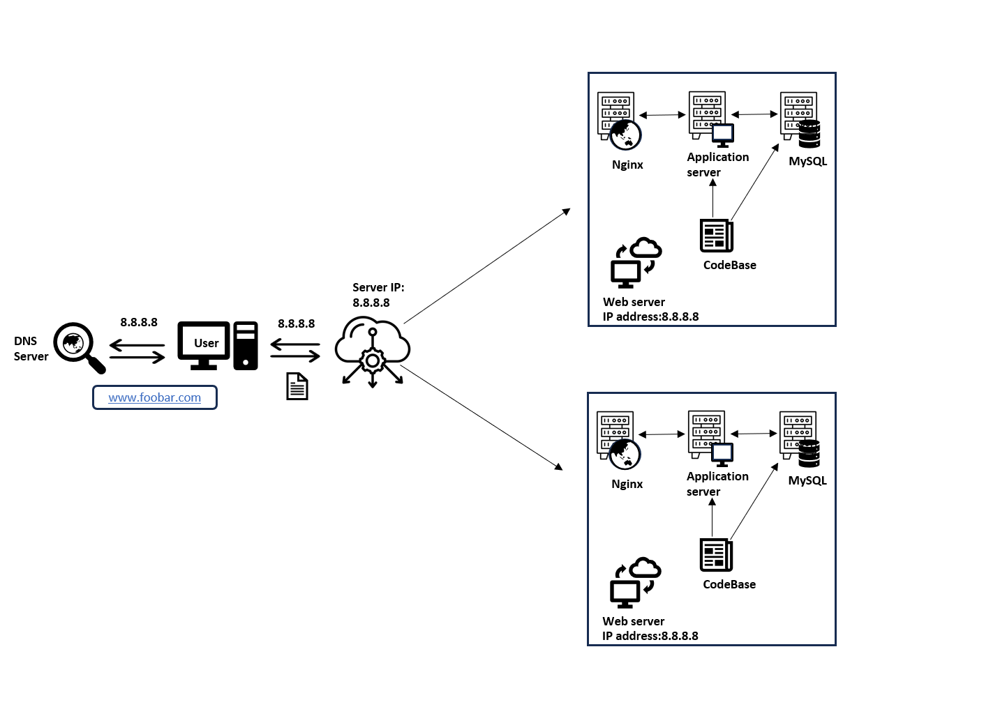

# Distributed Web Infrastructure

## Components:
- Load Balancer (HAproxy):
  - Distributes incoming traffic across multiple servers to improve performance and reliability.
  - Implements a round-robin distribution algorithm, ensuring equal distribution of requests among the servers.
  - Configured in an active-passive setup, where one load balancer is active, and the other is on standby, ready to take over if the active one fails.

- Web Server (Nginx):
  - Handles HTTP requests, serves static content, and acts as a reverse proxy for the application server.
  - Multiple web servers are used to handle a higher volume of traffic and provide redundancy.

- Application Server:
  - Runs the application code and processes dynamic requests.
  - Multiple application servers are used to distribute the load and ensure high availability.

- Application Files:
  - The website's code files, including HTML, CSS, JavaScript, and server-side scripts.
  - Stored on each application server for efficient access.

- MySQL Database Cluster:
  - Consists of a primary node and a replica node.
  - The primary node handles all write operations and replicates data to the replica node.
  - The replica node handles read operations and can be promoted to primary if the primary node fails.
  - Provides data redundancy and improves read performance.

## Reasons for Adding Components:
- Load Balancer:
  - Distributes traffic evenly among the servers, preventing overload on any single server.
  - Improves performance by efficiently utilizing server resources.
  - Enhances reliability by automatically routing traffic to healthy servers.

- Multiple Web Servers and Application Servers:
  - Handle higher traffic loads by distributing requests across multiple servers.
  - Provide redundancy, ensuring the website remains available even if a server fails.

- MySQL Database Cluster:
  - Offers data redundancy, protecting against data loss in case of a server failure.
  - Improves read performance by allowing the replica node to handle read queries.
  - Enables seamless failover if the primary node goes down.

## Issues:
- Single Point of Failure (SPOF):
  - The load balancer can be a SPOF if not configured in a high-availability setup.
  - If the primary MySQL database fails, writes cannot be performed until the replica is promoted to primary.

- Security:
  - Lack of firewalls exposes the servers to potential security threats.
  - No HTTPS configuration leaves the communication between clients and servers unencrypted.

- Monitoring:
  - No monitoring system is implemented, making it difficult to detect and resolve issues proactively.
