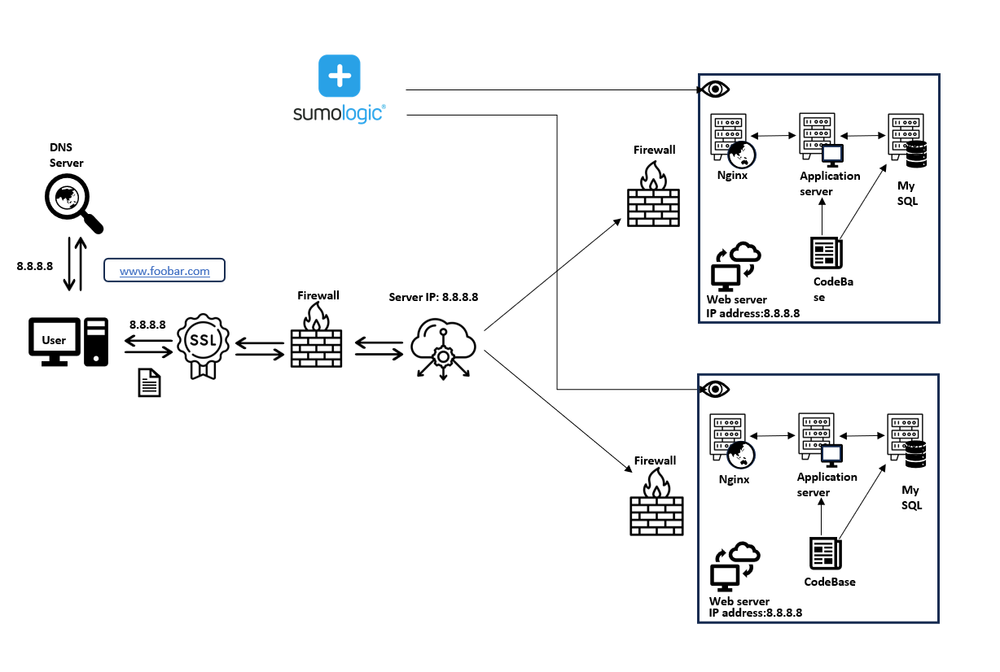

# Secured and Monitored Web Infrastructure

## Added Components:
- Firewalls:
  - Implement security measures to protect the servers from unauthorized access and potential threats.
  - Filter incoming and outgoing network traffic based on predefined security rules.
  - Placed at strategic points in the infrastructure to control traffic flow between components.

- SSL/TLS Certificate:
  - Enables HTTPS (Secure HTTP) communication between clients and the web server.
  - Encrypts the data transmitted over the network, ensuring confidentiality and integrity.
  - Provides authentication, verifying the identity of the website to the clients.

- Monitoring Clients:
  - Collect various metrics and logs from the servers and components.
  - Send the collected data to a centralized monitoring service like Sumologic for analysis and visualization.
  - Enable proactive monitoring, alerting, and troubleshooting of the infrastructure.

## Reasons for Adding Components:
- Firewalls:
  - Protect the servers from unauthorized access, reducing the risk of security breaches.
  - Control and filter traffic, preventing malicious requests and attacks.
  - Enforce network segmentation, isolating critical components from public access.

- SSL/TLS Certificate:
  - Secure the communication between clients and the web server, preventing eavesdropping and tampering.
  - Improve trust and credibility by displaying a secure padlock icon in the browser.
  - Comply with security best practices and protect sensitive user data.

- Monitoring Clients:
  - Provide visibility into the performance, health, and behavior of the infrastructure components.
  - Collect metrics such as CPU usage, memory utilization, network traffic, and application logs.
  - Enable proactive identification and resolution of issues before they impact users.
  - Facilitate capacity planning and resource optimization based on historical data and trends.

## Issues:
- SSL/TLS Termination at the Load Balancer:
  - Terminating SSL/TLS at the load balancer exposes unencrypted traffic between the load balancer and the web servers.
  - Sensitive data may be vulnerable to interception and tampering within the internal network.

- Single MySQL Primary:
  - Having only one MySQL primary server capable of accepting writes can be a single point of failure.
  - If the primary server goes down, write operations will be disrupted until a replica is promoted to primary.

- Homogeneous Server Components:
  - Having servers with identical components (web server, application server, and database) can lead to resource contention and performance issues.
  - Scaling individual components independently becomes challenging, as each server has a fixed set of components.
