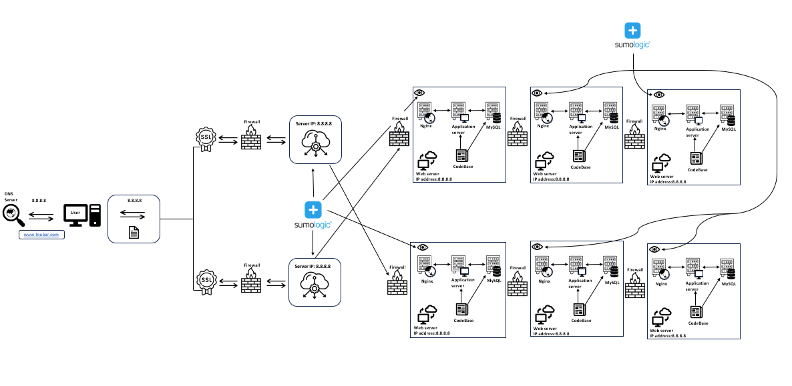

# Scaled-Up Web Infrastructure

## Scaled-Up Components:
- Additional Server:
  - Added one more server to the infrastructure to handle increased traffic and improve performance.
  - Allows for the distribution of load across multiple servers, enhancing scalability.

- Dedicated Servers for Components:
  - Split the web server, application server, and database components onto their own dedicated servers.
  - Provides better resource isolation and allows for independent scaling of each component.
  - Improves performance by reducing resource contention between components.

- Load Balancer Cluster:
  - Configured the two load balancers (HAproxy) as a cluster.
  - Ensures high availability and fault tolerance for the load balancing layer.
  - If one load balancer fails, the other can seamlessly take over the traffic distribution.

## Reasons for Scaling Up:
- Increased Traffic Handling:
  - The additional server and dedicated component servers allow the infrastructure to handle a higher volume of traffic.
  - Distributing the load across multiple servers improves performance and reduces the risk of overload.

- Independent Scaling:
  - Splitting the components onto dedicated servers enables independent scaling of each component based on its specific resource requirements.
  - Web servers, application servers, and databases can be scaled horizontally by adding more instances as needed.

- High Availability:
  - Configuring the load balancers as a cluster ensures high availability for the load balancing layer.
  - If one load balancer fails, the other can take over seamlessly, minimizing downtime and maintaining uninterrupted service.

- Resource Optimization:
  - Dedicating servers to specific components allows for better resource allocation and optimization.
  - Each component can be fine-tuned and configured according to its specific needs, improving overall performance.
